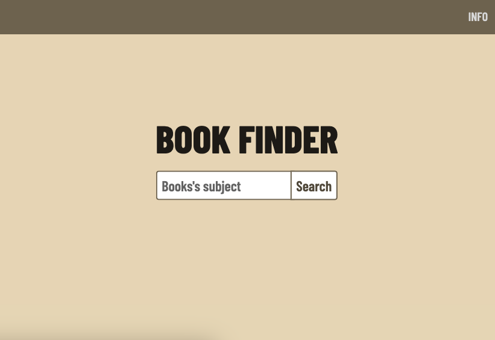

 <h1>Start2Impact, JavaScript Advanced</h1>

## Goals:
* Manage API calls to external services and retrieve the necessary data.
* Use Webpack to deploy the file.
* Work with arrays through external libraries such as Lodash.
* Working with environment variables and managing related files to ignore with git.
* Working with json.

## Built With:
* HTML5
* CSS3
* JavaScript
* Webpach
* Lodash
* Npm
* Netlify for deploy

## About
Questo progetto è stato sviluppato con start2impact seguendo le direttive della guida teorica presenta del corso "Full Stack Development"

Test the app on [Netlify](https://glistening-phoenix-cf085f.netlify.app/)

Start2Impact Profile: [https://talent.start2impact.it/profile/vittorio-gioda](https://talent.start2impact.it/profile/vittorio-gioda)

LikedIn: [https://www.linkedin.com/in/vittorio-gioda/](https://www.linkedin.com/in/vittorio-gioda/)

Project Link: [https://github.com/Teygeta/Project_Start2Impact_JS_Advanced](https://github.com/Teygeta/Project_Start2Impact_JS_Advanced)
